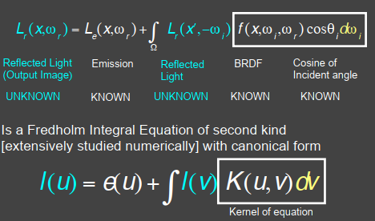
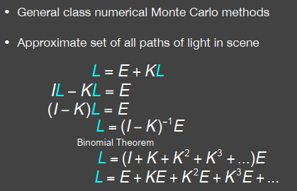
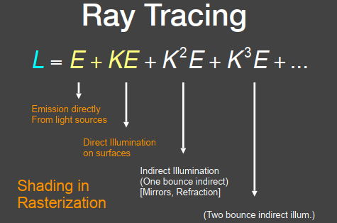

#cg #games101
# Why need Rendering Equation?

*True photorealism occurs when the [rendering equation](https://en.wikipedia.org/wiki/Rendering_equation "Rendering equation") is closely approximated or fully implemented.*

The various realistic [rendering](https://en.wikipedia.org/wiki/Rendering_(computer_graphics) "Rendering (computer graphics)") techniques in computer graphics attempt to solve this equation.

# What is Rendering Equation?

An integral equation in which *the equilibrium radiance leaving a point* is given as the *sum of emitted plus reflected radiance* under a geometric optics approximation.

## The Rendering Equation

Add and Emission term to make "The Reflection Equation" general!

$$L_o(p,\omega_o)=L_e(p,\omega_o)+\int_{\Omega+}L_i(p,\omega_i)f_r(p,\omega_i,\omega_o)(\vec{n}\cdot\vec{\omega_i})\mathrm{d}\omega_i$$

- Assuming that all directions are pointing **outwards!**

## Understanding the Rendering Equation

$$\begin{align}
\underset{Reflected\ Light\ (Output Image)}{L_r(x,\omega_r)} &= \underset{Emission}{L_e(x,\omega_r)} + \\& \underset{Incident\ Light\ (from\ light\ source)}{L_i(x,\omega_i)} \underset{BRDF}{f(x,\omega_i,\omega_r)}  \underset{Cosine\ of\ Incident\ Angle}{(\omega_i,n)}
\end{align}$$

- Replace $L_i(x,\omega_i)$ with $L_r(x',-\omega_i)$, and the direction is inversed.

- Some math operations, rewrite the Rendering Equation

- Be discretized to a simple matrix equation (or system of simultaneous linear equations)
- L, E are vectors, K is the light transport matrix
$$L = E + KL$$

- global illumination = dir + indir illumination

# Some Cons

Although the equation is very general, it does not capture every aspect of light reflection. See in [rendering equation wiki](https://en.wikipedia.org/wiki/Rendering_equation) Limitations part.

