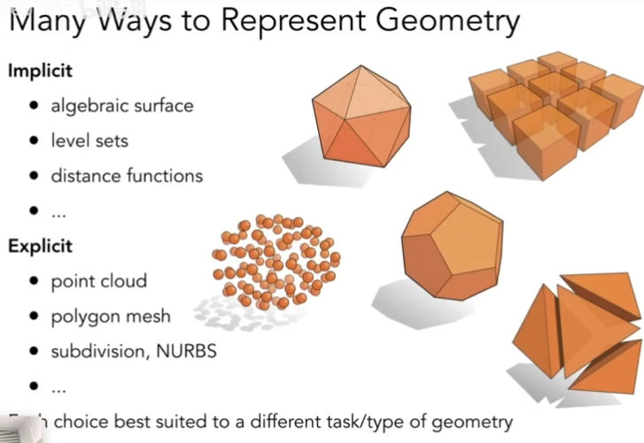
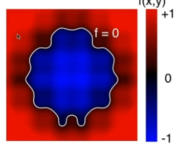
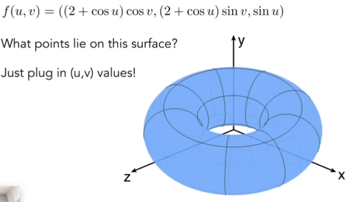
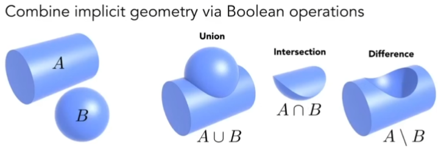
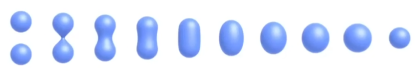
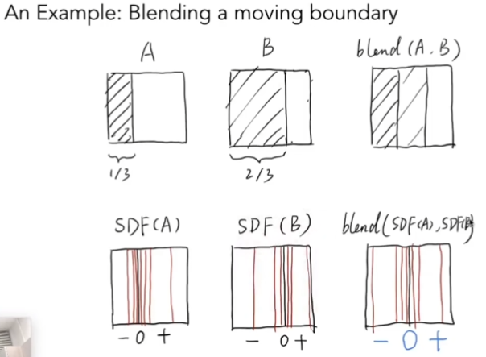

# 几何形体的表示方式

几何形体的表示有多种方式：

## 几何形体的隐式表示

- 基于classifying points
- 例如f(x,y)所定义的几何图形
- 问题：sampling can be hard，不直观，只是知道xyz之间的关系
- 好处是：Inside/Outside Tests Easy，很容易判断一个点在内还是在外

## 几何形体的显式表示

- 每个点都 *直接给出* 或者通过 *参数映射* 给出，points are given directly or via parameter mapping
- 好处：sampling is Easy
	- 每个点都能够直观表示出来，能够直接看到xyz分别是什么
- 问题：inside/outside test hard，难以判断一个点是在内还是在外

# 隐式几何表示方法

## 布尔运算（隐式）

【CSG】**constructive solid geometry (implicit)**

## 距离函数（隐式）

**distance functions(implicit)**

- 描述一个点到物体的最近距离（signed）
- giving minimum distance from anywhere to object

*一个应用距离函数的例子*：

A，左侧遮挡1/3；B，左侧遮挡2/3。如果想要将二者混合（blend），单纯的叠加会导致中间的1/3部分颜色较浅。

- *解决办法*：利用距离函数
	- A和B都可以得到一个关于遮挡边界的距离函数描述，从而将边界左右分为正负两侧
	- 随后将这个距离函数进行求和，从而得到一个blend后的结果

**Blending Distance Functions (Implicit)**

*那么*，如何再将距离函数恢复成几何形体的表面呢？

一个方法：**Level Set Methods(Implicit)**，这个概念可以类比地理上的等高线

## 分形表示（隐式）

Fractals (Implicit)，分形 -> 自相似 self-similarity，details at all scales

*Hard to control shape!*

## 隐式表示的Pros&Cons

**Pros：**
- compact description (e.g., a function)
	- 表述起来很容易
- certain queries easy (inside object, distance to surface)
	- 查询内外，距离函数等很容易
- good to ray-to-surface intersection
	- 容易做光线的求交
- for simple shapes, exact description / no sampling error
- easy to handle changes in topology (e.g., fluid)
**Cons：**
- diffcult to model complex shapes
	- 难以描述复杂的结合形体
- **所以需要用到显式的表示**

# 显式几何表示方法

## 点云（显式）

Point Cloud

## 多边形面（显式）

*应用最广泛的一种*

Polygon Mesh，三角形或多边形表示

*平时是如何在图形学表示用三角形面形成的物体的*

- 这个obj与编译出来的不是同一个东西
- 图中描述的为一个立方体，上方的v表示的是8个顶点，vn表示法线，vt为纹理坐标（会有共用）
- f处表示第几个顶点，第几个纹理坐标，第几个法线
	- `f 5/1/1 1/2/1 4/3/1`
		- `5/1/1` 表示第5个顶点，第1个纹理坐标，第1个法线
		- 其他几个同理，表示用这三个顶点来组成一个三角形

# Curves

## 贝塞尔曲线 Bezier Curves

*用一系列的控制点，去描述某个曲线*

下图为贝塞尔曲线的一个示例

*如何用任意多个点来画出一条贝塞尔曲线*

- **de Casteljau Algorithm**

三个点生成的贝塞尔曲线-quadratic Bezier，二次贝塞尔曲线

- 通过线性插值插入一个点
  - 
- 在另一边同样重复操作，并连接两点
  - 
- 从而找到的点 $b_0^2$ 为时间t时，贝塞尔曲线所在的位置
- 剩下的就是不断重复这个操作，从而就可以找到一条完整的贝塞尔曲线

**Cubic Bezier Curve-de Casteljau**

四个输入点，继续采用同样的线性插值，same recursive linear interpolations

## Evaluating Bezier Curves Algebraic Formula

本质上，通过几个操作点，经过某些操作，从而可以得到贝塞尔曲线上任意一个点的位置

接下来尝试使用数学表达式来描述这个过程：

**总结**：n个控制点所得到的n阶贝塞尔曲线上的点的公式

## 贝塞尔曲线的一些性质

- 起始点与结束点一定在给定的两个点上
- 曲线在起始点与结束点的切线
- 仿射变换下具有一个很好的性质，但是投影变换会导致变化
- **凸包**
	- 
	- *贝塞尔曲线上的点一定在控制点所形成的凸包之内*

## Piecewise Bezier Curves

piecewise 逐段

**贝塞尔曲线的问题**：控制点太多时，不容易用所有的控制点来进行控制，有些点甚至是用不到的。

*能否减少使用的控制点个数呢？*
- **利用分段贝塞尔曲线**

### 分段贝塞尔曲线

如图，每四个点定义一个贝塞尔曲线（图中四个点一般不会画到一起，只会在起始和结束两个位置显示）
如果某个点的两侧控制杆共线，则该点的导数是连续的

### 连续 Continuity

- C0连续，贝塞尔曲线在该点在几何上是相接的
	- 第一段的结束点是第二段的起始点
	- 
	- 
- C1连续，切线连续
	- 两个控制点与贝塞尔曲线上点共线且距离相等
	- 
	- 

## 其他类型的样条线

splines 样条线

### B-splines

- Short for basis splines
- Require more information than Bezier curves
- Satisfy all important properties that Bezier curves have (i.e. superset)

希望有一种*局部性质*，从而使得样条线在修改某些部分时，不至于影响到整个样条线的整体，例如分段的贝塞尔曲线。

B-splines则是不需要特地分段即可

- **B-splines 极其复杂，还有另一个叫做 NURBS**
- 高阶贝塞尔曲线
- 曲线上的操作

# Surfaces

将贝塞尔曲线引申到曲面：

*那么如何将贝塞尔曲线延伸到贝塞尔曲面呢*

## Bicubic Bezier Surface Patch

16（4 x 4）个控制点

同样利用到了双线性插值

*问题思考，不同的贝塞尔曲线如何无缝衔接*

## Evaluating Bezier Surfaces

贝塞尔曲面同样可以由参数表述，所以也是显示表示

- 使用参数（u，v）来表述曲面的位置
- 

# Mesh Operations: Geometry Processing

使用最多的还是三角形这样的网格描述

- Mesh Subdivision (upsampling)
- Mesh Simplification (down sampling)
- Mesh Regularization (same `#triangles`)

## Subdivision 曲面细分

和 triangle meshes 的细分类似
- 第一步，创建更多的三角形（顶点）
- 第二步，优化位置

### Loop Subdivision

这里的Loop不是循环，是提出者的family name

**先细分，再调整**

#### 步骤简述

- 第一步，**细分**，split each triangle into four，三角形数量增多
	- 
- 第二步，**调整**，new vertex positions according to weights
	- New / old vertices updated differently，区分出新顶点和旧顶点
	- 

#### Update 更新顶点位置

- 对于新顶点

中间白点为新的顶点，更新其位置，即做加权平均

- 对于旧顶点

保留一部分自身原本位置信息，以及一部分周围的信息，二者进行加权平均

*degree：度，一个顶点和它相连的边数就是degree*

#### Results

### Catmull-Clark Subdivision (General Mesh)

Loop细分只能针对三角形的细分，*Catmull-Clark Subdivision则可以对网格进行细分*

步骤：
- Add vertex in each face（面的中心）
- Add midpoint on each edge（边的中心）
- Connect all new vertices

*思考经过一次细分后，*
- 还有多少个奇异点？
	- 4个
- 度为多少？
	- 5（old）
	- 3（new）
	- *总结得到，非四边形面中新增的点，就一定会出现奇异点*
- 有多少非四边形面？
	- 之前的非四边形面都消失了
- **catmull-clark细分，在第一次细分后增加了非四边形面数个奇异点，之后再细分也不会再增加了**

Loop Subdivision和Catmull-Clark Subdivision：

## Simplification 曲面简化

目的是减少mesh元素但同时维持overall shape

*但如果观察远处时，就会发现，适当减少mesh元素后效果还可以。有些时候没有必要用到过于复杂的模型*

那么接下来的问题是，*如何计算？*

其中一个方法：Edge Collapse，边坍缩

### Collapsing Edge

*再思考一个问题，如何判断哪些边需要坍缩，哪些边不需要坍缩？*

### Quadric Error Metrics

二次误差度量

- *思考*，下图中，如何防止蓝色三角形顶点的位置从而使得蓝色三角形与原本的灰色区域形状基本一致呢？
	- 单纯求平均效果不理想
	- *利用二次误差度量，希望把这个点放到一个位置，使得这个点到和它相关联的面的位置距离平方和最小*

**如何去选要去坍缩的边？**

