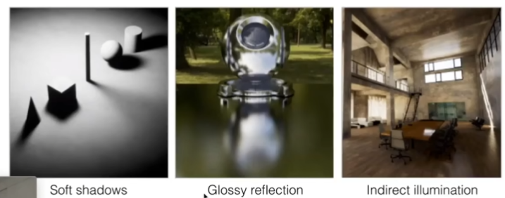
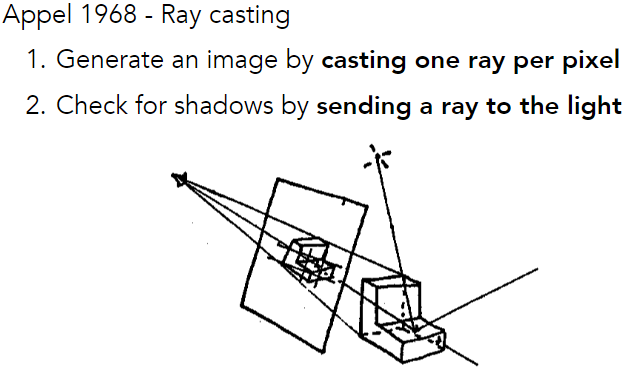
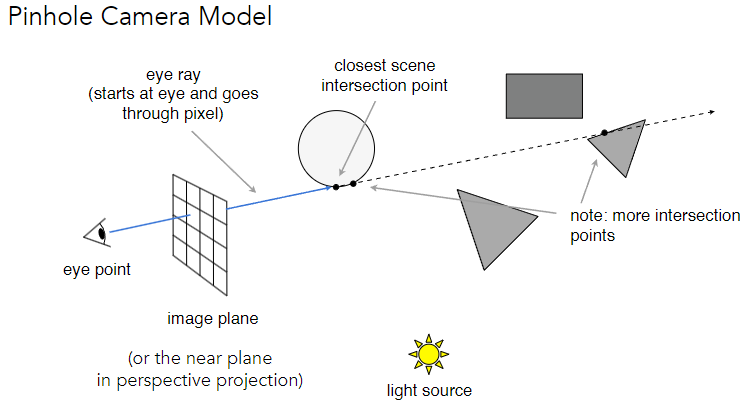
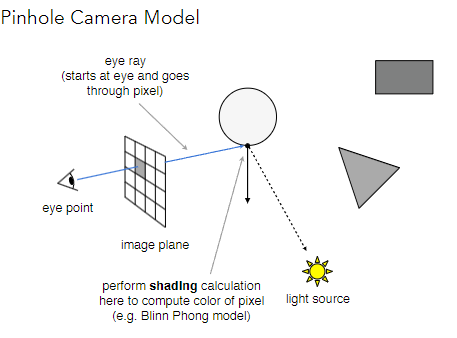

> 阅读材料：[Fundamentals of Computer Graphics, Fourth Edition](Fundamentals%20of%20Computer%20Graphics,%20Fourth%20Edition.pdf)
> 第 4 章（Ray Tracing）

---

# Why Ray Tracing?

Whitted-Style Ray Tracing

光栅化的不足：

- Rasterization couldn't handle **global** effects well
  - (Soft) shadows
  - especially when the light bounces **more than once**
  - 
- Rasterization is fast, but **quality is relatively low**

光线追踪的对比点：

- Ray tracing is accurate, but is **very slow**
  - rasterization: **real-time**
  - ray tracing: offline

# 基础的光线追踪算法

## Ray Casting 光线投射

- 沿着光路反向追踪直至接触到物体
- 再从该点与光源连线检查该点是否对光源可见
- 最后产生阴影结果

#### Generating Eye Rays

一般把eye point就认为是相机所在位置，如图中所示。

- 从眼睛/相机位置投射一条光线，这条光线会与世界中的物体相交（可能会出现与多个物体相交）；选取最近相交的物体，记录该交点

#### Shading Pixels （Local Only）

然后开始考虑该点会不会被照亮

- 从该交点向光源连一条线（shadow ray）
- 如果这条线没有被任何物体遮挡，说明该点被照亮；反之，说明该点处于阴影里
- 之后开始计算该点的着色（Blinn-Phong等着色模型），并写入对应像素

## Whitted-Style Ray tracing

但实际上光线会进行多次的反射折射等等，利用Whitted-Style方法可以解决这个问题

### Recursive Ray tracing

## Ray-object intersections

### Implicit surfaces

### Triangles

## Axis-Aligned Bounding Boxs (AABB)

# Acceleration & Radiometry

- Using AABB to acelerate ray tracing
	- Uniform grids
	- Spatial paritions
- Basic radiometry 辐射度量学

## Uniform Spatial Partitions (Grids)

### Preprocess-Build Acceleration Grid

1. Find bounding box
2. Create grid
3. Store each object in overlapping cells

# Light Transport & Global Illumination

今天的一些内容：

## 回顾一些概念

- Radient Energy（很少用）
- Radiant Flux（power）
	- *在图形学中更多应用单位时间内的能量*
	- 这里的能量一般都是特质这里的power
- Radiant Intensity
	- 单位立体角的能量（power）
- Solid Angle

**微分立体角 differential solid angles**

主要关注两个角度：$\theta$ 和 $\phi$

*并不是对球面上的均匀划分*

## Irradiance

定义：

*面与光线垂直*，要将光线投影到垂直方向

**Lambert's Consine Law**

光线与面的夹角，可以思考四季变化。

回想光源向四周辐射能量，会随路径长度而损失

可以发现其实是*Irradiance*在衰减，而不是*intensity*

## Radiance（非常重要）

这个概念目的是描述光线的某个属性

下面是Radiance的定义

*单位立体角*与*单位投影面积*

回顾之前学过的概念，并将这几个概念进行联合理解：

## Incident Radiance

