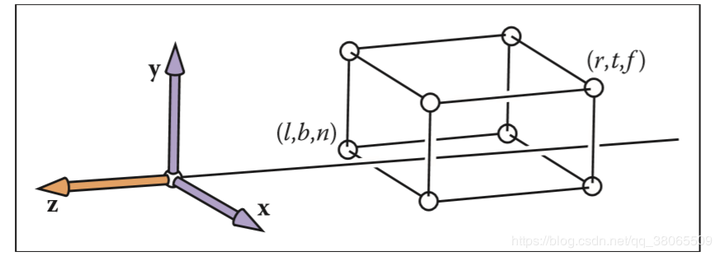
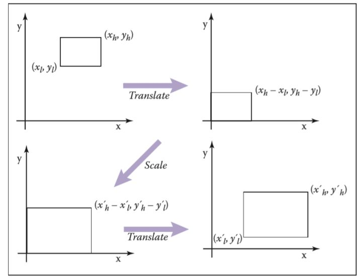

# 视图变换 viewing transformation

视图变换的任务：将虚拟世界中（3维）以（x，y，z）为坐标的物体变换到以一个个像素位置（x，y）来表示的屏幕坐标系之中（2维）。具体的步骤可以细分为如下：

- **模型变换 Model Transformation**:
	- 目的将虚拟世界中或游戏场景中的物体调整至它们应该在的位置
- **摄像机变换 Camera Transformation**：
	- 物体与相机的相对位置
- **投影变换 Projection Transformation**：
	- 目的：将三维空间投影至标准二维平面（$[-1,1]^2$）上（原三维空间中的坐标Z作为二维空间中前后关系的遮挡检测）
- **视口变换 Viewport Transformation**：
	- 将标准二维平面映射到屏幕的分辨率范围之内，即$[-1,1]^2 \to [0,width]*[0,height]$，其中$width$和$height$是屏幕分辨率大小

## 01 模型变换 Model Transformation

三维空间中，将物体移动到应该在的位置，本质就是利用基本的变换矩阵，通过平移、缩放、旋转等将物体移动到想要的地方

## 02 相机变换 Camera Transformation

为了得到相机与物体之间的相对位置关系，*可以将相机放在三维世界中的坐标位置*

这就涉及到了对相机位置的变换，这里给出相机的几个位置标准：

- 相机/眼睛位置 Position：e
- 观察方向 gaze position：g
- 视点正上方向 view-up vector：t

从而我们可以把“将相机移动到三维世界坐标原点”具体为如下步骤：
- 通过平移矩阵，将相机位置移动到原点
- 通过旋转矩阵，将相机的坐标系与世界坐标系重合

下面给出变换矩阵的具体形式：

$$\begin{align*}
M_{cam} &= R \cdot T \\
&= \begin{pmatrix} 
x_{g\times t}	&y_{g\times t}	&z_{g\times t}	&0 \\
x_t				&y_t			&z_t			&0 \\
x_{-g}			&y_{-g}			&z_{-g}			&0 \\
0				&0				&0				&1
\end{pmatrix}
\cdot
\begin{pmatrix}
1	&0	&0	&-x_e \\
0	&0	&0	&-y_e \\
0	&0	&0	&-z_e \\
0	&0	&0	&1
\end{pmatrix}
\end{align*}$$

## 03 投影变换 Projection transformation

**将三维空间映射到二维空间的关键步骤**

具体有两种投影方式：
- 正交投影 Orthographic Projection
  - 不会改变坐标的相对位置
  - 光线为平行传播
- 透视投影 Perspective Projection

### 03-1 正交投影

具体的实现方法：将物体全部转换为一个 $[-1,1]^3$ 的空间之中，坐标 $Z$ 同样为了用于后期判断遮挡关系

> 为什么要压缩到一个小立方体？
> 答：为了计算方便。在后期进行视口变换，进行屏幕坐标映射的时候会将物体重新拉伸回来

定义可视空间范围：

$$\begin{align*}
x &= l \equiv left\ plane \\
x &= r \equiv right\ plane \\
y &=b \equiv bottom\ plane \\
y &= t \equiv top\ plane \\
z &= n \equiv near\ plane \\
z &= f \equiv far\ plane
\end{align*}$$

用一个二维空间的缩放 $[x_l, y_l] \cdot [x_h,y_h] \to [x'_l,y'_l] \cdot [x'_h, y'_h]$ 来说明：

据此，可以将空间的缩放步骤列出：
- 将原空间范围的左下角移动至原点
- 将空间放大到给定的倍数
- 将缩放后的空间范围移动到新空间范围

用变换矩阵表示为：
$$\begin{align}
	window &= translate(x'_l,y'_l)\ scale(\frac{x'_h-x'_l}{x_h-x_l},\frac{y'_h-y'_l}{y_h-y_l})\ translate(-x_l, -y_l) \\
	&=
	\begin{pmatrix}
		1	&0	&x'_l \\
		0	&1	&y'_l \\
		0	&0	&1
	\end{pmatrix}
	\begin{pmatrix}
		\frac{x'_h-x'_l}{x_h-x_l}	&0	&0 \\
		0	&\frac{y'_h-y'_l}{y_h-y_l}	&0 \\
		0	&0	&1
	\end{pmatrix}
	\begin{pmatrix}
		1	&0	&-x_l \\
		0	&1	&-y_l \\
		0	&0	&1
	\end{pmatrix}
	\\
	&=\begin{bmatrix}
		\frac{x'_h-x'_l}{x_h-x_l} &0 &\frac{x'_lx_h-x'_hx_l}{x_h-x_l} \\
		0 &\frac{y'_h-y'_l}{y_h-y_l} &\frac{y'_ly_h-y'_hy_l}{y_h-y_l} \\
		0 &0 &1
	\end{bmatrix}
\end{align}
$$

推广到三维：

$$
\begin{bmatrix}
	\frac{x'_h-x'_l}{x_h-x_l} &0 &0 &\frac{x'_lx_h-x'_hx_l}{x_h-x_l} 
	\\
	0 &\frac{y'_h-y'_l}{y_h-y_l} &0 &\frac{y'_ly_h-y'_hy_l}{y_h-y_l}
	\\
	0 &0 &\frac{z'_h-z'_l}{z_h-z_l} &\frac{z'_lz_h-z'_hz_l}{z_h-z_l}
	\\
	0 &0 &0 &1
\end{bmatrix}
$$

于是，直接带入正交投影中三维空间范围，可得正交变换矩阵 $M_{orth}$

$$M_{orth}=\begin{pmatrix}
	\frac{2}{r-l} &0 &0 &-\frac{r+l}{r-l} \\
	0 & \frac{2}{t-b} &0 &-\frac{t+b}{t-b} \\
	0 &0 &\frac{2}{n-f} &-\frac{n+f}{n-f} \\
	0 &0 &0 &1
\end{pmatrix}$$

## 03-2 透视投影 Perspection Projection

透视投影是类似于人眼看东西的方式，遵循近大远小的关系

