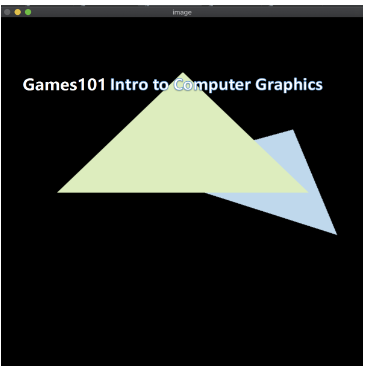
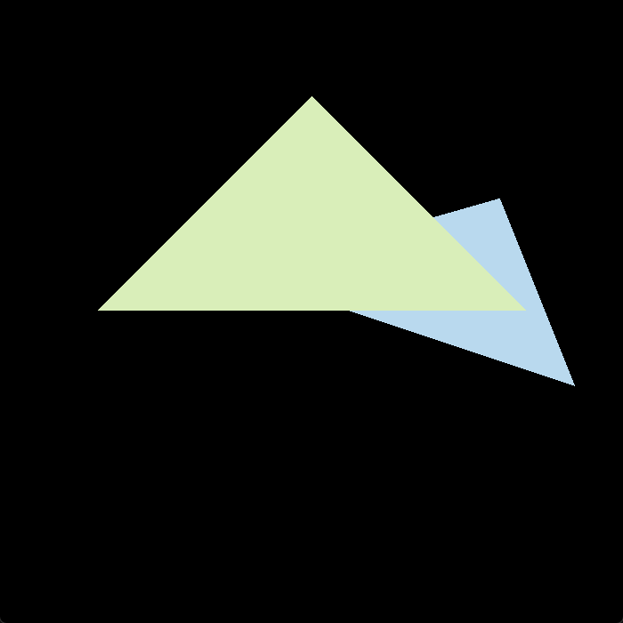
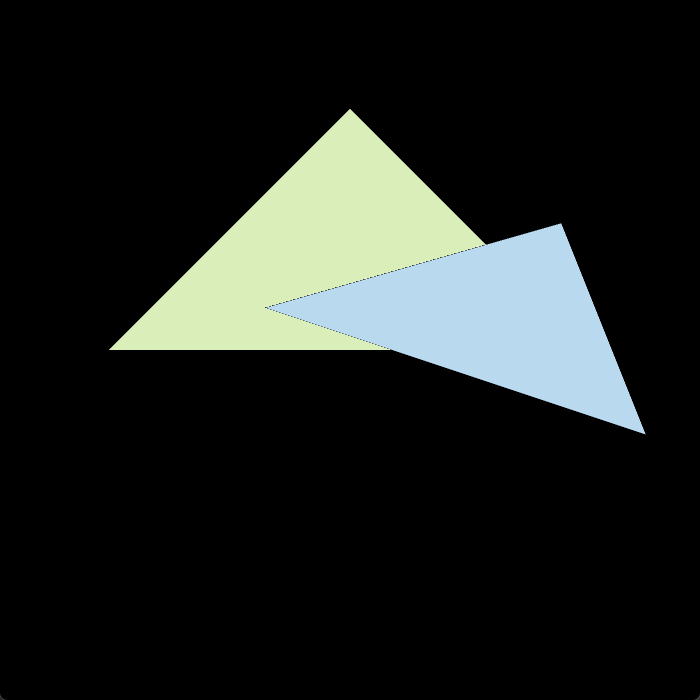
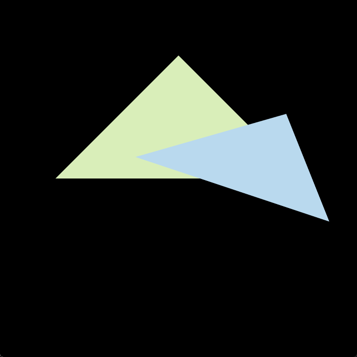

# 作业2 Triangle and Z-Buffering

## 问题

> 自行填写并调用函数 `rasterize_triangle(const Triangle& t)` 在屏幕上栅格化一个实心三角形。

函数 `rasterize_triangle(const Triangle& t)` 的内部工作流程如下：

- 创建三角形的2维 bounding box
- 遍历 bounding box 内所有像素（整数索引）。然后使用像素中心的屏幕空间坐标来检查中心点是否在三角形内
- 如果在内部，则将其位置处的 **插值深度值（interpolated depth value）** 与深度缓冲区（depth buffer）中的相应值进行比较
- 如果当前点更靠近相机，设置像素颜色并更新深度缓冲区（depth buffer）

需要修改的函数如下：

- `rasterize_triangle()`: 执行三角形栅格化算法
- `static bool insideTriangle()`: 测试点是否在三角形内

正确的输出结果如图：



## 确定思路

### 判断测试点是否在三角形内

利用测试点与三角形三个顶点之间构成的向量计算叉积。最后得到的三个叉积结果应该都为正或负（正负取决于三角形顶点的方向）

### 三角形栅格化算法

给定三角形位置，对整个显示范围内的像素进行扫描。利用编写好的函数判断像素是否在三角形内部。

如果在，则将该位置处的插值深度值与深度缓冲区存储的深度值进行比较，如果插值深度小于深度缓冲区深度，则更新缓冲区的深度值，并将像素颜色设置为对应三角形的颜色。


## 开始编写

### 两个函数

`insideTriangle()` ：判断测试点是否在三角形内

```cpp
// 判断测试点是否在三角形内
static bool insideTriangle(float x, float y, const Vector3f* _v)
{
    //测试点的坐标为(x, y)
    //三角形三点的坐标分别为_v[0], _v[1], _v[2]
    //叉乘公式为(x1, y1)X(x2, y2) = x1*y2 - y1*x2

// STEP01
// 准备三角形各边的的向量
    Eigen::Vector2f side1;
    side1 << _v[1].x() - _v[0].x(), _v[1].y() - _v[0].y();
    Eigen::Vector2f side2;
    side2 << _v[2].x() - _v[1].x(), _v[2].y() - _v[1].y();
    Eigen::Vector2f side3;
    side3 << _v[0].x() - _v[2].x(), _v[0].y() - _v[2].y();

// STEP02
// 准备测量点和三角形各点连线的向量
    Eigen::Vector2f v1;
    v1 << x - _v[0].x(), y - _v[0].y();
    Eigen::Vector2f v2;
    v2 << x - _v[1].x(), y - _v[1].y();
    Eigen::Vector2f v3;
    v3 << x - _v[2].x(), y - _v[2].y();

// STEP03
// 三角形各边的的向量叉乘测量点和三角形各点连线的向量
    float z1 = side1.x() * v1.y() - side1.y() * v1.x();
    float z2 = side2.x() * v2.y() - side2.y() * v2.x();
    float z3 = side3.x() * v3.y() - side3.y() * v3.x();

// STEP04
// 判断叉乘结果是否有相同的符号
    if ((z1 > 0 && z2 > 0 && z3 > 0) || (z1 < 0 && z2 < 0 && z3 < 0))
    {
        return true;
    }
    else
    {
        return false;
    }
}
```

`rasterize_triangle()` ：栅格化三角形

```cpp
//执行三角形栅格化算法
void rst::rasterizer::rasterize_triangle(const Triangle& t)
{
    auto v = t.toVector4();

// STEP01
// 寻找 bounding box
    // 用矩形将三角形包围起来,找到矩形的四个顶点，构建三角形包围盒
    float min_x = std::min(v[0].x(), std::min(v[1].x(), v[2].x()));
    float max_x = std::max(v[0].x(), std::max(v[1].x(), v[2].x()));
    float min_y = std::min(v[0].y(), std::min(v[1].y(), v[2].y()));
    float max_y = std::max(v[0].y(), std::max(v[1].y(), v[2].y()));

// STEP02
// 遍历 bounding box 中所有测试点
    // 两层 for 循环遍历
    for (int x = min_x; x <= max_x; x++)
    {
        for (int y = min_y; y <= max_y; y++)
        {
// STEP03
// 判断像素是否在三角形内部
            float min_depth = FLT_MAX; //最小深度，默认是无穷远
            if (insideTriangle(x, y, t.v))
            {
                // 如果在内部，则将其位置处的插值深度值 (interpolated depth value) 与深度缓冲区 (depth buffer) 中的相应值进行比较
                auto tup = computeBarycentric2D(x, y, t.v);
                float alpha, beta, gamma;

                std::tie(alpha, beta, gamma) = tup;
                float w_reciprocal = 1.0 / (alpha / v[0].w() + beta / v[1].w() + gamma / v[2].w());
                float z_interpolated = alpha * v[0].z() / v[0].w() + beta * v[1].z() / v[1].w() + gamma * v[2].z() / v[2].w();
                z_interpolated *= w_reciprocal;
                // 更新最小深度值
                min_depth = std::min(z_interpolated, min_depth);
                if (depth_buf[get_index(x, y)] > min_depth)
                {//如果x,y所在点的深度小于z-buffer的深度
                    Vector3f color = t.getColor();// 获得最上层应该更新的颜色
                    Vector3f point;
                    point << x, y, min_depth;
                    //更新深度
                    depth_buf[get_index(x, y)] = min_depth;
                    //更新所在点的颜色
                    set_pixel(point, color);
                }
            }
        }
    }
}
```

### 运行结果



## 提高项

> 用 super-sampling 处理 Anti-aliasing : 注意到当放大图像时，图片边缘会有锯齿感，可以使用 super-sampling 来解决这个问题。
> 方法：对每个像素进行 2*2 采样，并比较前后的结果（这里不考虑像素与像素之间的样本复用）。需要注意的是，对于像素内的每一个样本都需要维护它自己的深度值，即每一个像素都需要维护一个 `sample_list` 。最后，如果实现正确的话，得到的三角形不应该有不正常的黑边

### MSAA 算法

### 算法实现

```cpp

```
### 运行结果


与之前的运行结果进行对比可以发现，先前蓝色三角形边缘处明显的锯齿感在此时已经几乎感觉不到了。

### 黑边分析

仔细观察运行结果，发现在绿色三角形和蓝色三角形重叠部分的边缘上出现了很窄的黑边。

修改代码，让蓝色三角形处于绿色三角形上方，进行对比。



为了对比，这里再给出不使用 MSAA 算法时，蓝色三角形在上方时的情况：


可以发现，黑色描边只在使用了 MSAA 采样算法时出现。

因为在 MSAA 中通过计算图形对某个像素的覆盖率来调整位于图形边缘位置的像素颜色，当覆盖率过低时，接近于 0 的权重值会使得原本的 rgb 颜色数值同样接近于 0，进而导致显示出的颜色接近于黑色。同时蓝色三角形又位于绿色三角形的下方，这就导致重合部分的蓝色完全不会写入像素。

### 解决办法

对每个像素的四个采样点用深度和颜色表进行维护，最后设置像素颜色时，根据四个采样点的颜色之和进行计算。

```cpp
void rst::rasterizer::rasterize_triangle(const Triangle& t) {//执行三角形栅格化算法
    auto v = t.toVector4();
    std::vector<float> msaa{ 0.25,0.25,0.75,0.75,0.25 };

    // 用矩形将三角形包围起来,找到矩形的四个顶点，构建三角形包围盒
    float min_x = std::min(v[0].x(), std::min(v[1].x(), v[2].x()));
    float max_x = std::max(v[0].x(), std::max(v[1].x(), v[2].x()));
    float min_y = std::min(v[0].y(), std::min(v[1].y(), v[2].y()));
    float max_y = std::max(v[0].y(), std::max(v[1].y(), v[2].y()));

    // 遍历三角形包围盒中的所有测试点
    for (int x = min_x; x <= max_x; x++)
    {
        for (int y = min_y; y <= max_y; y++)
        {
            float min_depth = FLT_MAX; //最小深度，默认是无穷远
            int eid = get_index(x, y) * 4;
            for (int k = 0; k < 4; k++)
            {
                if (insideTriangle(x + msaa[k + 1], y + msaa[k], t.v))
                {
                    //如果在三角形内部，计算当前深度,得到当前最小深度
                    auto tup = computeBarycentric2D(x, y, t.v);
                    float alpha, beta, gamma;
                    std::tie(alpha, beta, gamma) = tup;
                    float w_reciprocal = 1.0 / (alpha / v[0].w() + beta / v[1].w() + gamma / v[2].w());
                    float z_interpolated = alpha * v[0].z() / v[0].w() + beta * v[1].z() / v[1].w() + gamma * v[2].z() / v[2].w();
                    z_interpolated *= w_reciprocal;

// depth_sample 维护采样点深度值
// frame_sample 维护采样点颜色，/4 为了保证求和后其整体亮度不变
                    if (z_interpolated < depth_sample[eid + k]) {// 根据插值更新深度列表和颜色
                        depth_sample[eid + k] = z_interpolated;
                        frame_sample[eid + k] = t.getColor() / 4;
                    }

                    min_depth = std::min(depth_sample[eid+k], z_interpolated);
                }
            }
            Vector3f color = frame_sample[eid + 0] + frame_sample[eid + 1] + frame_sample[eid + 2] + frame_sample[eid + 3];
            Vector3f point;
            point << x, y, min_depth;
            set_pixel(point, color);
            depth_buf[get_index(x, y)] = std::min(min_depth, depth_buf[get_index(x,y)]);
        }
    }
}
```

头文件中声明

```cpp
namespace rst{
    class rasterizer{
        ...
        private:
            std::vector<Eigen::Vector3f> frame_sample;
            std::vector<float> depth_sample;

    };
}
```

构造函数初始化：

```cpp
rst::rasterizer::rasterizer(int w, int h) : width(w), height(h)
{
    frame_buf.resize(w * h);
    depth_buf.resize(w * h);

// 因为每个像素以 2*2 采样
// 所以需要维护的列表是之前的 4 倍
    frame_sample.resize(w * h * 4);
    depth_sample.resize(w * h * 4);
}
```

```cpp
void rst::rasterizer::clear(rst::Buffers buff)
{
    if ((buff & rst::Buffers::Color) == rst::Buffers::Color)
    {
        std::fill(frame_buf.begin(), frame_buf.end(), Eigen::Vector3f{0, 0, 0});
        std::fill(frame_sample.begin(), frame_sample.end(), Eigen::Vector3f{ 0,0,0 });
    }
    if ((buff & rst::Buffers::Depth) == rst::Buffers::Depth)
    {
        std::fill(depth_buf.begin(), depth_buf.end(), std::numeric_limits<float>::infinity());
        std::fill(depth_sample.begin(), depth_sample.end(), std::numeric_limits<float>::infinity());
    }
}
```

### 运行结果





## 遗留问题

黑边，背景色混入问题
