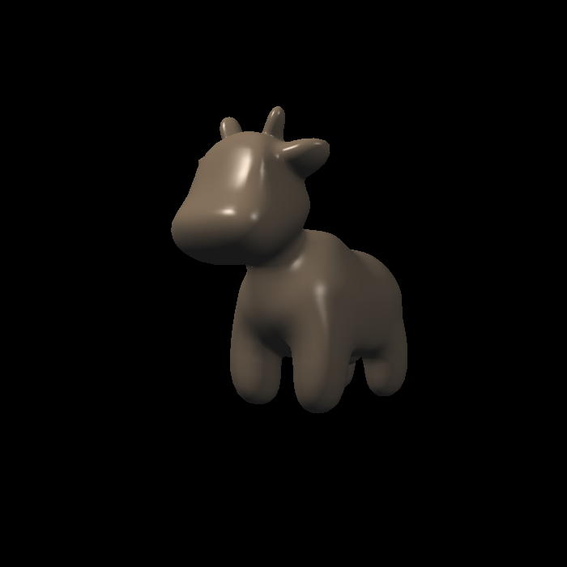
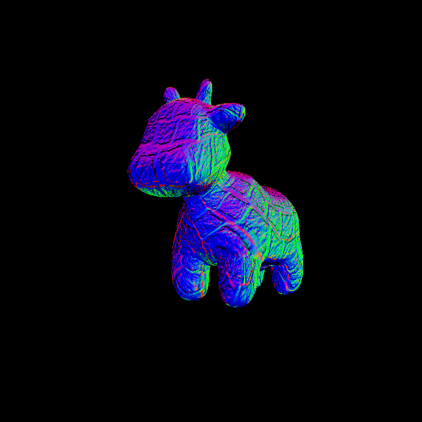
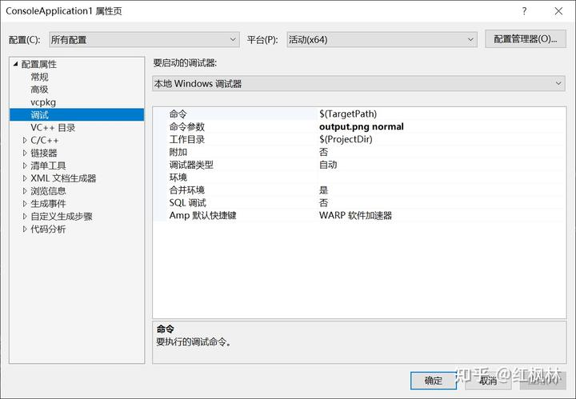

# 作业3 Pipeline and Shading

# 问题

1. 修改函数 `rasterize_triangle(const Triangle& t) in rasterizer.cpp` ：实现与作业2类似的插值算法，实现*法向量*、*颜色*、*纹理颜色*的插值。
2. 修改函数 `get_projection_matrix() in main.cpp`：将之前的实验中实现的投影矩阵填到此处，此时可以运行：`./Rasterizer output.png normal` 来观察法向量实现结果
3. 修改函数 `phong_fragment_shader() in main.cpp`：实现Blinn-Phong模型计算 Fragment Color
4. 修改函数 `texture_fragment_shader() in main.cpp`：在实现Blinn-Phong的基础上，将纹理颜色视为公式中的kd，实现 Texture Shading Fragment Shader
5. 修改函数 `bump_fragment_shader() in main.cpp`：在实现Blinn-Phong的基础上，仔细阅读该函数中的注释，实现Bump mapping
6. 修改函数 `displacement_fragment_shader() in main.cpp`：在实现Bump mapping的基础上，实现displacement mapping

# 确定思路

- 第一步：
	- 实现 `rasterize_triangle(const Triangle& t) in rasterizer.cpp`
	- 实现 `get_projection_matrix() in main.cpp`
	- 运行 `./Rasterizer output.png normal`，观察结果是否正确
- 第二步
	- 实现Blinn-Phong模型：`phong_fragment_shader() in main.cpp`
	- 运行 `./Rasterizer output.png phong`，观察结果是否正确
	- 实现纹理着色：`texture_fragment_shader() in main.cpp`
	- 运行 `./Rasterizer output.png texture`，观察结果是否正确
- 第三步
	- 实现：`bump_fragment_shader() in main.cpp`
	- 运行 `./Rasterizer output.png bump`，观察结果是否正确
	- 实现：`displacement_fragment_shader() in main.cpp`
	- 运行 `./Rasterizer output.png displacement`，观察结果是否正确
- 【Bonus】第四步
	- 尝试其他更多模型
	- 双线性纹理插值：使用双线性插值进行纹理采样，在Texture类中实现一个新方法 `Vector3f getColorBilinear(float u, float v)` 并通过fragment shader调用它。为了使双线性插值的效果更加明显，你应该考虑选择更小的纹理图。

# 代码实现

## 第一步

`rasterize_triangle(const Triangle& t) in rasterizer.cpp`

该函数的实现思路与hw2中类似，首先找到bounding box

```cpp
// Find bounding box
auto x_max = std::max(v[0].x(), std::max(v[1].x(), v[2].x()));
auto x_min = std::min(v[0].x(), std::min(v[1].x(), v[2].x()));
auto y_max = std::max(v[0].y(), std::max(v[1].y(), v[2].y()));
auto y_min = std::min(v[0].y(), std::min(v[1].y(), v[2].y()));
```

随后利用for循环遍历bounding box区域内部的点，并判断该点是否在目标物体内部。注意这里判断的是pixel的中心，所以加了0.5

```
for (int x = x_min; x <= x_max; x++) {
	for (int y = y_min; y <= y_max; y++) {
		if(insideTriangle((float)x + 0.5, (float)y + 0.5, t.v))
		{
			...
		}
	}
}
```

对处于物体内部的点利用插值算法计算深度插值，

**需要注意的是**，插值算法是以*重心坐标*为基础的，而重心坐标在经过*投影变换*后会发生改变，所以需要计算出重心坐标后再使用透视矫正插值。

```cpp
//深度插值 利用透视校正插值
float Z = 1.0 / (alpha / v[0].w() + beta / v[1].w() + gamma / v[2].w());
float zp = alpha * v[0].z() / v[0].w() + beta * v[1].z() / v[1].w() + gamma * v[2].z() / v[2].w();
zp *= Z;
```

再将深度插值结果与z-buffer中的深度信息进行比较，并进行法向量、颜色、纹理颜色的插值计算。**注意**在计算 `shadingcoords` 时，使用的坐标是 view space 中的坐标，进行插值是为了还原在 camera space 中的坐标，[参考](https://games-cn.org/forums/topic/zuoye3-interpolated_shadingcoords/)。

最后更新pixel的颜色和z-buffer中的深度信息即可。

```cpp
if (zp <depth_buf[get_index(x,y)]){
	 auto interpolated_color = interpolate(alpha, beta, gamma, t.color[0], t.color[1], t.color[2], 1);
     auto interpolated_normal = interpolate(alpha, beta, gamma, t.normal[0], t.normal[1], t.normal[2],1);
     auto interpolated_texcoords = interpolate(alpha, beta, gamma, t.tex_coords[0], t.tex_coords[1], t.tex_coords[2], 1);

	//见上边分析
     auto interpolated_shadingcoords = interpolate(alpha, beta, gamma, view_pos[0], view_pos[1], view_pos[2], 1);

     fragment_shader_payload payload(interpolated_color, interpolated_normal.normalized(), interpolated_texcoords, texture ? &*texture : nullptr);
     payload.view_pos = interpolated_shadingcoords;

     auto pixel_color = fragment_shader(payload);
     depth_buf[get_index(x, y)] = zp;
     set_pixel(Eigen::Vector2i(x, y), pixel_color);
}
```

`get_projection_matrix() in main.cpp`

这里主要是将之前作业中完成的投影变换代码复制过来。

### 运行结果

- `./Rasterizer output.png normal`


### 问题

很多人遇到了前后颠倒等问题

经过搜索以及自行测试发现，主要问题在于z轴的正负问题上。

## 第二步

实现Blinn-Phong模型：`phong_fragment_shader() in main.cpp`

参考笔记：[Shading 着色](Shading%20着色.md)

用到公式如下：
**环境光项+漫反射项+高光项=Blinn-Phong反射模型**


**需要注意**：除了计算 distance decay 的时候，light 到 point 的长度计算要用到非归一化的向量，其他的如法向量n，point到light的向量，以及半程向量等都需要进行归一化即 `vector.normalized()`

**其他在做作业过程中遇到的一些问题**
- k系数和光强相乘，这里计算的是column-wise的product，程序中为 `k.cwiseProduct(light.intensity)`
- 环境光 ambient 使用的光强和满散射diffuse以及高光specular使用的 `light.intensity` 不同，一般为固定值，在作业中为 `amb_light_intensity`
	- 期间在写 texture_fragment_shader 的时候写错，导致最后出现的模型整体发光
- `std::max(0.0f, pow(...))` 还遇到了两个参数类型不符的问题，给0指定下字面夫类型即可

**关键就是，所有表示方向向量都要进行归一化处理**

实现纹理着色：`texture_fragment_shader() in main.cpp`

这一步和实现Blinn-Phong类似，只是将系数k视为纹理性质即可

不同点在于，需要从当前的fragment的纹理坐标中获取对应的texture values

```cpp
Eigen::Vector3f return_color = {0, 0, 0};
    if (payload.texture)
    {
        // TODO: Get the texture value at the texture coordinates of the current fragment
        return_color << payload.texture->getColor(payload.tex_coords.x(), payload.tex_coords.y());
    }
    Eigen::Vector3f texture_color;
    texture_color << return_color.x(), return_color.y(), return_color.z();
```

并在后边与phong类似部分的计算处，将kd值修改为texture

```cpp
Eigen::Vector3f ka = Eigen::Vector3f(0.005, 0.005, 0.005);
Eigen::Vector3f kd = texture_color / 255.f;
Eigen::Vector3f ks = Eigen::Vector3f(0.7937, 0.7937, 0.7937);
```

### 运行结果

**phong shading和texture shading的区别在于diffuse系数kd的不同**：
- phong shading从RGB中提取
- texture shading是根据UV坐标从纹理中提取

-  `./Rasterizer output.png phong`


- `./Rasterizer output.png texture`


### 问题

在运行phong的时候出现了异常

```cpp
Error: Assertion failed ((unsigned)(i1 * DataType<_Tp>::channels) < (unsigned)(size.p[1] * channels())) in cv::Mat
```

参考：https://zhuanlan.zhihu.com/p/419872527

修改：纹理颜色的接口 `Vector3f getColor(float u, float v)`

主要是添加坐标限定，防止越界

```cpp
 Eigen::Vector3f getColor(float u, float v)
    {
        // 坐标限定
        if (u < 0) u = 0;
        if (u > 1) u = 1;
        if (v < 0) v = 0;
        if (v > 1) v = 1;

        auto u_img = u * width;
        auto v_img = (1 - v) * height;
        auto color = image_data.at<cv::Vec3b>(v_img, u_img);
        return Eigen::Vector3f(color[0], color[1], color[2]);
}
```


## 第三步

`bump_fragment_shader() in main.cpp`

凹凸贴图具体参考笔记：[TextureMapping 纹理映射](./img/TextureMapping%20纹理映射.md)

主要思路是根据texture上的差值计算dU和dV，所以需要获得tex_coords坐标，最后通过TBN变换矩阵改变发现朝向从而在人的视觉感官上改变物体表面的凹凸感

```cpp
Eigen::Vector3f n = normal;

float x = n.x();
float y = n.y();
float z = n.z();

Eigen::Vector3f t = Eigen::Vector3f(x * y / sqrt(x * x + z * z), sqrt(x * x + z * z), z * y / sqrt(x * x + z * z));

Eigen::Vector3f b = n.cross(t);
Eigen::Matrix3f TBN;

TBN << t.x(), t.y(), t.z(),

	b.x(), b.y(), b.z(),

	n.x(), n.y(), n.z();

 float u = payload.tex_coords.x();
float v = payload.tex_coords.y();
float w = payload.texture->width;
float h = payload.texture->height; 

float dU = kh * kn * (payload.texture->getColor(u + 1 / w, v).norm() - payload.texture->getColor(u, v).norm());
float dV = kh * kn * (payload.texture->getColor(u, v + 1 / w).norm() - payload.texture->getColor(u, v).norm());

Eigen::Vector3f ln{ -dU, -dV, 1 };

normal = (TBN * ln).normalized();
```

`displacement_fragment_shader() in main.cpp`

主要部分与bump实现相同，但由于displacement是实实在在对物体表面的顶点等进行位移移动的，所以需要利用此时新计算出来的法线，再结合之前写过的phong模型进行计算

### 运行结果

-  `./Rasterizer output.png bump`

-  `./Rasterizer output.png displacement`


## 提高项


# 额外收获

在vs 2019中运行带命令行参数的程序

例如本次作业，片元着色器渲染的方式是根据 `main(int argc, const char** argv)` 的传入参数决定的
- argc：argument count，表示传入main函数的参数个数
- argv：argument vector，表示传入main函数的参数序列或指针，并且第一个参数`argv[0]`一定是程序的名字，并且包含了程序所在的完整路径

vs 2019中，通过 `调试->属性` 进行修改命令行参数即可



