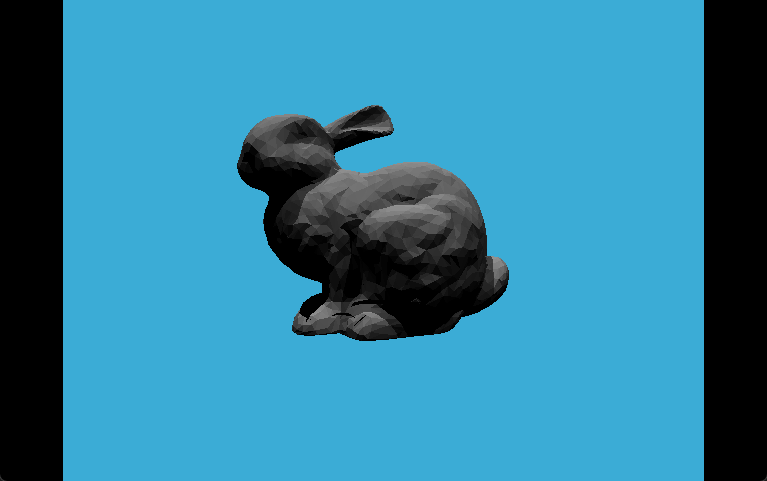

# 作业6：加速结构

在之前的练习中实现了基础的光线追踪算法，即光线传输、光线与三角形相交。寻找交点的方法是通过遍历场景所有物体，判断光线是否与它相交。在场景中物体数量不大的情况下能够取得不错的结果，但是如歌场景中的物体数量增多时，这种做法是非常低效的。

因此，我们需要加速结构来加速计算求交点的过程。

## 问题

本次练习中，我们重点关注物体划分算法Bounding Volume Hierarchy（BVH）。要求实现Ray-Bounding Volume求交与BVH查找。

需要完成的函数：

- `Render()` in Renderer.cpp：hw5中的光线生成过程，并按照新框架更新相应的调用格式
- `Triangle()::getIntersection` in Triangle.hpp：将光线-三角形相交函数粘贴到这里，并按照新框架更新相应的调用格式

- `IntersectP(const Ray &ray, const Vector3f& invDir, const std::array<int, 3>& dirIsNeg)` in the Bounds3.cpp：这个函数的作用是判断包围盒BoundingBox与光线是否相交，需要按照课程介绍的算法实现求交过程

- `getIntersection(BVHBuildNode* node, const Ray ray)` in BVH.cpp：建立BVH之后，可以利用它来加速求交的过程。该过程递归进行，需要在其中调用上面实现的 `Bounds3::IntersectP`

## 思路确定

### 旧代码修改

`Render()` in Renderer.cpp：

hw5中代码实现
```cpp
// generate primary ray direction
float x = (2 * (i + 0.5) / 1280 - 1) * imageAspectRatio * scale;
float y = (1 - 2 * (j + 0.5) / 960) * scale;
Vector3f dir = normalize(Vector3f(x, y, -1)); // Don't forget to normalize this direction!
framebuffer[m++] = castRay(eye_pos, dir, scene, 0);
```

新框架中的castRay函数：`Vector3f Scene::castRay(const Ray &ray, int depth)`

结构体Ray中封装了光线的起点和方向，所以传入时需要先将原本代码中的eye_pos和dir封装为结构体Ray再传入

`Triangle()::getIntersection` in Triangle.hpp：

内容不变

### 重点关注部分

#### 判断包围盒BoundingBox与光线是否相交

`IntersectP(const Ray &ray, const Vector3f& invDir, const std::array<int, 3>& dirIsNeg)`

该函数的目的是判断包围盒BoundingBox与光线是否相交，返回bool值。

这里采用的是AABB类型的包围盒，可以直接利用公式计算，如计算光线与平行于yz平面的BoundingBox的交点：

$$t_x = \frac{p'_x-o_x}{d_x}$$

其余几个同理。

- 一个小讨论：
  - 根据作业描述，我们可以只使用两个点就可以描述这个AABB的包围盒。代码中为Bounds3类，其中的`pMin`和`pMax`，即为这个bounding box体对角线位置的两个点。
  - 可以用这两个点描述bounding box的原因：此时采取的包围盒形式为Axis-Aligned Bounding Box，坐标取值均为最小值的点 `(x_min, y_min, z_min)` 和取值均为最大值的点 `(x_max, y_max, z_max)` 就已经包含了该box顶点的所有取值。

选取对应坐标带入公式即可求出对应的相交结果。

- 思考ray的的方向问题：
  - 发现对于x平面，有两个结果：`t_x_min`和`t_x_max`，其余几个同理，分别对应光线从x面进入Box的时间 $t_{enter}$ 和从x面离开Box的时间 $t_{exit}$ 。但此时需要注意一个问题：**光线是从`x_max`面指向`x_min`面，还是从`x_min`面指向`x_max`面**。这涉及到这两个t的值分别是哪个对应进入Box的时间，哪个对应离开Box的时间。
  - 所以，这里需要根据参数 `dirIsNeg` 来判断，`dirIsNeg==0`则说明从`x_max`面指向`x_min`面；`dirIsNeg==1`则说明从`x_min`面指向`x_max`面。

确保了方向问题后，就可以来确定一个ray进入box和离开box的时间了。

- 思考ray进出box的时间问题：
  - 在知道了ray从各个面进入box和离开box的时间后，还需要思考，三个进入时间和三个离开时间，分别应该选择哪个作为box的进出时间点呢？
  - 对于进入时间 $t_{enter}$ 很容易可以想到，ray进入box的时间，一定是三个 $t_{enter}$ 最大的时候，即最晚发生进入某一对面所对应的时间点
  - 同理对于离开时间 $t_{exit}$ ，ray离开box的时间，一定是三个 $t_{exit}$ 最小的时候，即最早离开某一对面所对应的时间点

所以我们可以确定，ray进出box的时间为：

$$\begin{align*}
    t_{enter} &= \max(tx_{enter}, ty_{enter}, tz_{enter}) \\
    t_{exit} &= \min(tx_{exit}, ty_{exit}, tz_{exit})
\end{align*}$$

最后，我们还需要讨论一下取值问题：
- 如果 $t_{exit} < 0$ ，说明box在ray之后，这种情况很明显是无意义，即不发生intersection的
- 如果 $t_{exit} >= 0 \ \&\& \ t_{enter}<0$，说明光源就在box内部，此时肯定是发生intersection的
- 并且对于进出时间还需要满足 $t_{exit} > t_{enter}<0$，才能保证取值是有意义的

综上，ray和AABB发生intersection的条件为：$$t_{enter} < t_{exit} \ \&\& \ t_{exit}>=0$$

#### BVH加速结构

`getIntersection(BVHBuildNode* node, const Ray ray)`

如果场景中物体数量少，则可以将ray和这些物体一个个求交。但如果场景中物体很多，这种计算是非常低效的。所以需要使用**加速结构**来加速求交的过程。

这里使用的方法为BVH即Bounding Volume Hierarchy。

这种方法的主要思路是根据物体来划分场景的不同部分，形成多叉树结构，场景中一个个物体的bounding box构成最终的leaf node，子节点的bounding box为其下所有leaf node的bounding box“之和”。

**BVH能够加速求交过程的原因**是它免除了计算ray和一些*很明显不可能相交*的物体的交点计算过程。如果ray和该物体的子节点（即比该物体的bounding box更大的范围区域）都不相交，那就绝不可能与该子节点之下的任何节点发生相交。

所以在代码实现中，我们需要递归调用函数 `getIntersection()`。
- 递归停止条件：
  - 如果ray和该node不相交，返回 `{}`
  - 如果node为叶节点，则判断是否和该node中的obj相交，并返回结果
- 如果不是叶节点，分别计算ray和节点两侧的相交结果
  - **注意，这里可能会出现与多个物体相交的情况，此时就需要判断哪个物体在前，哪个物体在后。即比较它们的depth，返回更小的depth的结果**

## 代码实现

- `Render()` in Renderer.cpp

```cpp
// generate primary ray direction
float x = (2 * (i + 0.5) / (float)scene.width - 1) *
            imageAspectRatio * scale;
float y = (1 - 2 * (j + 0.5) / (float)scene.height) * scale;
Vector3f dir = normalize(Vector3f(x, y, -1));
Ray ray(eye_pos, dir);
framebuffer[m++] = scene.castRay(ray, 0);
```

- `Triangle()::getIntersection` in Triangle.hpp

```cpp
if (t_tmp > 0.0 && u > 0.0 && v > 0.0 && (1 - u - v) > 0){
    inter.happened = true;
    inter.coords = (1 - u - v) * v0 + u * v1 + v * v2;
    inter.normal = normal;
    inter.distance = sqrt(dotProduct(inter.coords, inter.coords));
    inter.obj = this;
    inter.m = m;
    
    return inter;
}
```

- `IntersectP(const Ray &ray, const Vector3f& invDir, const std::array<int, 3>& dirIsNeg)` in the Bounds3.cpp

```cpp
inline bool Bounds3::IntersectP(const Ray& ray, const Vector3f& invDir,
                                const std::array<int, 3>& dirIsNeg) const
{
    // invDir: ray direction(x,y,z), invDir=(1.0/x,1.0/y,1.0/z), use this because Multiply is faster that Division
    // dirIsNeg: ray direction(x,y,z), dirIsNeg=[int(x>0),int(y>0),int(z>0)], use this to simplify your logic
    // TODO: test if ray bound intersects
    float t_min_x = (pMin.x - ray.origin.x) * invDir.x;
    float t_max_x = (pMax.x - ray.origin.x) * invDir.x;
    // 方向为负，说明从max_x面进去，min_x面出来
    // 所以max_x的交点是进去的时间，min_x的交点是出来的时间
    if (dirIsNeg[0] == 0) {
        std::swap(t_min_x, t_max_x);
    }

    float t_min_y = (pMin.y - ray.origin.y) * invDir.y;
    float t_max_y = (pMax.y - ray.origin.y) * invDir.y;
    if (dirIsNeg[1] == 0) {
        std::swap(t_min_y, t_max_y);
    }

    float t_min_z = (pMin.z - ray.origin.z) * invDir.z;
    float t_max_z = (pMax.z - ray.origin.z) * invDir.z;
    if (dirIsNeg[2] == 0) {
        std::swap(t_min_z, t_max_z);
    }

    float t_enter = std::max(t_min_x, std::max(t_min_y, t_min_z));
    float t_exit = std::min(t_max_x, std::min(t_max_y, t_max_z));

    if (t_enter < t_exit && t_exit>0) {
        return true;
    }
    else {
        return false;
    }
}
```

- `getIntersection(BVHBuildNode* node, const Ray ray)` in BVH.cpp

```cpp
Intersection BVHAccel::getIntersection(BVHBuildNode* node, const Ray& ray) const
{
    // TODO: Traverse the BVH to find intersection
    Vector3f invDir = ray.direction_inv;
    std::array<int, 3> dirIsNeg;
    dirIsNeg[0] = (ray.direction.x > 0) ? 1 : 0;
    dirIsNeg[1] = (ray.direction.y > 0) ? 1 : 0;
    dirIsNeg[2] = (ray.direction.z > 0) ? 1 : 0;

    if (!node->bounds.IntersectP(ray, invDir, dirIsNeg)) {
        return {};
    };

    if (node->left == nullptr && node->right == nullptr) {
        return node->object->getIntersection(ray);
    }

    Intersection left_leaf = BVHAccel::getIntersection(node->left, ray);
    Intersection right_leaf = BVHAccel::getIntersection(node->right, ray);

    return (left_leaf.distance < right_leaf.distance) ? left_leaf : right_leaf;

}
```

## 运行结果


